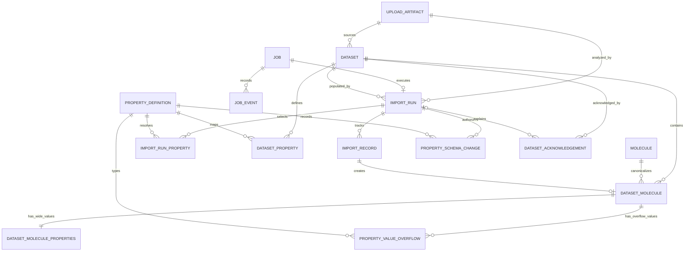
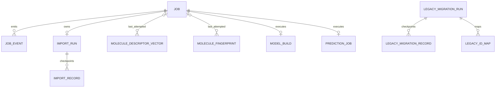
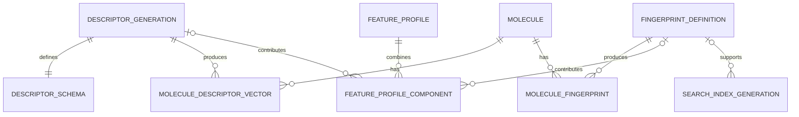
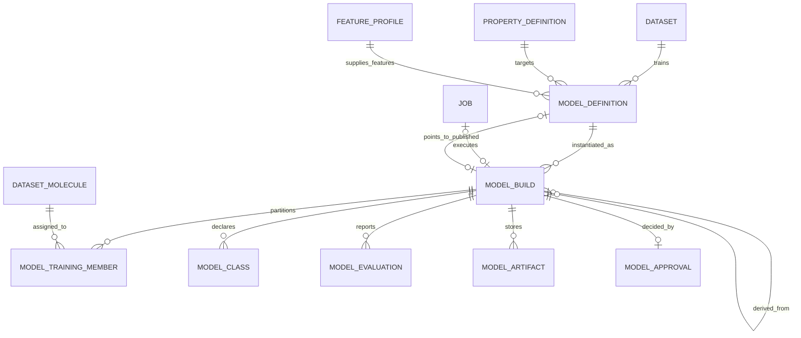
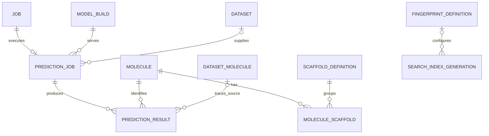

# MolClass V3 Database Model

Status: Migration-defined model through V10

Database: `molclass_v3`

Engine: InnoDB for every domain table

Target server: MariaDB 10.11+

Schema sources: `sql/v3/V1__molclass_v3_baseline.sql` through
`sql/v3/V10__model_build_supersession.sql`

## 1. Scope and design goals

1. Preserve exact source dataset records while sharing normalized canonical molecules.
2. Keep internal molecule IDs separate from dataset-scoped compound identifiers.
3. Make upload analysis, import, feature generation, migration, model building, and
   prediction transactional and resumable.
4. Continue after isolated record failures while retaining a durable per-record audit
   trail and enforcing the configured import failure threshold.
5. Version chemistry features and machine-learning builds rather than overwriting them.
6. Store model artifacts in MariaDB with immutable manifests, byte lengths, and SHA-256
   checksums.
7. Preserve arbitrary SDF properties using registry-backed wide columns plus typed
   overflow storage.
8. Support human-reviewed publication with one explicit active-build pointer per model
   definition.
9. Keep the legacy schema read only during migration and rebuilding.

## 2. Migration and live-schema status

The repository migration chain is the schema source of truth. A migration file being
present does not mean it has been applied to an existing database.

| Migration | Repository-defined change | Deployment status documented here |
| --- | --- | --- |
| V1 | Clean InnoDB baseline containing the complete domain model. The current baseline also contains the final V8 and V9 index definitions for a new installation. | Baseline source |
| V2 | Resumable legacy migration records and model-definition provenance/class metadata. | In migration chain |
| V3 | Per-molecule feature retry ownership and attempt counters. | In migration chain |
| V4 | Additional model generation, artifact, and evaluation constraints/indexes. | In migration chain |
| V5 | One immutable decision per build and `model_definition.published_model_build_id`. | In migration chain |
| V6 | Global compound-identifier and molecule-name search indexes. | In migration chain |
| V7 | Initial job-type claim index ordered by availability before priority. | Last recorded live worker-index layout |
| V8 | Replaces the V7 worker index and adds the status-filtered model-review index. | Present in SQL; not yet applied to the live database |
| V9 | Adds the unfiltered newest-first model-review index. | Present in SQL; not yet applied to the live database |
| V10 | Adds the immutable technical-supersession relationship for unapproved model builds. | In migration chain |

The live-state labels above preserve the latest recorded verification. No database
connection was made while updating this document. Existing databases must apply V8 and
V9 explicitly; editing V1 does not retrofit an already-applied baseline.

## 3. InnoDB entity inventory

| Area | Tables |
| --- | --- |
| Queue and audit | `job`, `job_event`, `worker_lock`, `audit_event` |
| Upload and import | `upload_artifact`, `import_run`, `import_run_property`, `import_record` |
| Dataset and properties | `dataset`, `dataset_property`, `dataset_molecule`, `dataset_molecule_properties`, `property_definition`, `property_value_overflow`, `property_schema_change`, `dataset_acknowledgement` |
| Canonical chemistry | `molecule`, `scaffold_definition`, `molecule_scaffold` |
| Feature generations | `descriptor_generation`, `descriptor_schema`, `molecule_descriptor_vector`, `fingerprint_definition`, `molecule_fingerprint`, `feature_profile`, `feature_profile_component`, `search_index_generation` |
| Models and prediction | `model_definition`, `model_build`, `model_build_supersession`, `model_training_member`, `model_class`, `model_evaluation`, `model_artifact`, `model_approval`, `prediction_job`, `prediction_result` |
| Legacy migration | `legacy_migration_run`, `legacy_migration_record`, `legacy_id_map` |

All listed tables are declared with `ENGINE=InnoDB`. Foreign keys provide referential
integrity for concrete relationships. `audit_event.entity_id`, `legacy_id_map.v3_id`,
and similar cross-entity audit references are intentionally polymorphic and therefore
are not foreign keys.

## 4. Dataset, molecule, import, and property relationships



`molecule` stores normalized canonical chemistry and owns the internal `molecule_id`.
`dataset_molecule` preserves one source record's original structure, record number,
compound identifier, and dataset membership. Several dataset records may reference the
same canonical molecule without sharing labels or measurements.

The authoritative source-record identity is `(dataset_id, source_identifier)`, enforced
by `uq_dataset_source_identifier`. Record order is independently unique through
`(dataset_id, record_number)`. A compound identifier is imported from the selected,
non-null SDF identifier property; it is never used as the canonical `molecule_id`.

`dataset.identifier_property_id` identifies the selected property definition.
`dataset_property` records per-dataset selection, identifier status, target/search
eligibility, observed counts, inferred type, and resolved SQL type. `import_run_property`
freezes the corresponding choices and type decisions for one import manifest.

`property_definition` registers the exact trimmed, case-sensitive SDF property name and
its server-generated physical column, SQL family, DDL type, and storage mode. Reusing a
property name reuses the same registry entry and physical data column. A new property is
registered before its allowlisted DDL is applied and recorded in
`property_schema_change`.

`dataset_molecule_properties` is a one-to-one wide-property extension of
`dataset_molecule`. The Java importer may add only registry-backed, allowlisted columns
after whole-file analysis and acquisition of the fenced schema lock.
`property_value_overflow` stores exactly one typed value per dataset molecule/property
pair when a value cannot safely use the wide column. Safe widening is:

```text
INT -> BIGINT -> DECIMAL -> DOUBLE -> VARCHAR -> TEXT
```

## 5. Resumable jobs, runsteps, and record tracking



`job` is the durable queue record. It stores `status`, `runstep`, priority, payload,
availability, lease owner/expiry, heartbeat, attempts, cancellation, timestamps, and
failure details. `job_event` preserves ordered runstep transitions and diagnostics.
`worker_lock` provides lease ownership plus a monotonically increasing fencing token for
operations such as serialized property DDL.

`import_run` freezes the upload, dataset, identifier, selected-property manifest,
checksums, failure threshold, counts, `status`, and `runstep`. `import_record` adds a
unique checkpoint per SDF record with its own `status`, `runstep`, `attempt_count`,
resolved `molecule_id`, and error details. Each molecule record is processed in its own
transaction, allowing failed records to remain inspectable while later records continue.
Restart logic resumes incomplete records instead of replaying successful records.

`legacy_migration_run` and `legacy_migration_record` provide the same run/runstep and
per-source-record recovery pattern for legacy conversion. `legacy_id_map` preserves
legacy-to-v3 identity mappings; multiple legacy molecule IDs may map to one canonical v3
molecule.

V3 adds nullable `last_job_id` and `attempt_count` to both feature-value tables. These
columns make descriptor and fingerprint retries attributable and resumable at molecule
granularity. `model_build.runstep` provides durable build-stage tracking, while its
optional `job_id` is unique so a queue job cannot create multiple build attempts.

## 6. Feature generation relationships



`descriptor_generation` identifies an immutable descriptor implementation/configuration
using CDK, Java, normalization, implementation, vector-format, JSON configuration, and a
configuration digest. Its one-to-one `descriptor_schema` fixes descriptor order/count in
a checksummed manifest. `molecule_descriptor_vector` stores one binary vector and missing
mask per `(descriptor_generation_id, molecule_id)`, including explicit status and failure
details.

`fingerprint_definition` similarly versions implementation class, CDK,
normalization, bit length, configuration, and status. `molecule_fingerprint` stores one
binary bitset per molecule/definition with bit count, checksum, fallback state, status,
and failure details.

Generation rows are not overwritten when dependencies or configuration change. A new
generation is created, populated, checked, and then represented by its status and
`published_at`. Existing vectors remain tied to the generation that produced them.

`feature_profile` replaces implicit composite names such as MCAT, ALL, and JUMBO with an
ordered, versioned list of `feature_profile_component` rows. A component references
exactly one descriptor generation or one fingerprint definition, enforced by a check
constraint. Model definitions point to the profile, making their complete feature
contract reproducible.

## 7. Model, approval, and publication relationships



`model_definition` is the durable modeling intent: dataset, target property, exact
feature profile, algorithm/options, feature selection, class contract, provenance, and
status. All legacy model rows can be represented even when a configuration is not yet
supported by the v3 builder.

`model_build` is an append-only generation attempt. It records parent build, queue job,
generation label/number, runstep, Java/CDK/Weka/schema/code versions, random seed, split
configuration, partition counts, checksummed manifest, timestamps, and terminal error.
The definition/generation uniqueness constraints prevent generation reuse. A completed
build and its membership, classes, evaluations, manifest, and artifacts form one
immutable review unit.

`model_training_member` preserves exact TRAIN, VALIDATION, HOLDOUT, and EXCLUDED
membership. `model_class` preserves class ordering and support. `model_evaluation`
contains structured per-set, per-fold, aggregate, and per-class metrics.
`model_artifact` stores one artifact per kind with a LONGBLOB payload, declared byte
length, SHA-256 checksum, and a database check that length matches the payload.

The V3 evaluation contract retains the independent TRAIN, VALIDATION, and HOLDOUT
results. If either independent evaluation partition contains fewer than 10 members of
any observed class, the builder also performs deterministic stratified cross-validation
over all non-excluded molecules. It uses 10 folds for datasets with at least 10 usable
molecules and one molecule per fold below that limit. `CROSS_VALIDATION` stores six
aggregate metrics with `fold_number IS NULL` and the same six metrics for every numbered
fold. The checksummed build manifest records the trigger, fold count, minimum class
support, and random seed; approval rejects a build when any required CV evidence is
missing or its fold supports do not add up to the evaluated population.

Weighted precision, recall, and F1 use the `WEKA_WEIGHTED_AGGREGATES_V2` contract:
an observed class that receives no predicted positives contributes zero rather than
propagating Weka `NaN` to the aggregate. Weighted one-vs-rest AUC excludes classes for
which positive or negative examples are absent and renormalizes over evaluable classes.
If no class is evaluable, AUC is SQL `NULL` with machine-readable `NOT_APPLICABLE`
provenance. Degenerate Kappa is represented the same way and is never replaced with an
invented numeric score.

V10 separates technical replacement from human model review. An undecided
`AWAITING_APPROVAL` build may transition atomically to `SUPERSEDED` only when it
has no `model_approval` decision. Exactly one `model_build_supersession` row records
the actor, reason, replacement contract, and timestamp; artifacts and all evaluation
evidence remain immutable. The definition becomes `PENDING_REBUILD` when it has no
published generation, or remains `ACTIVE` when an older published generation is still
serving. A new generation links to the previous generation through
`model_build.parent_model_build_id`.

V5 makes `model_approval.model_build_id` unique: a build can receive exactly one
immutable human decision, either approval or rejection. Publication is not inferred
from build success. `model_definition.published_model_build_id` is a nullable, unique
foreign key to `model_build` and is the authoritative pointer used for prediction. The
publication transaction must lock the definition and candidate build, validate the
build's immutable metrics, partitions, manifest, and streamed artifact checksums, insert
the decision, mark the build published, and update this pointer atomically.

The foreign keys and uniqueness constraints encode identity and one-decision/one-pointer
rules. Terminal-row immutability and the requirement that a pointer reference an
approved build are enforced by the approval application transaction and production
audit, not by update-blocking database triggers. Operators must not update or delete
completed build evidence or approval rows manually.

## 8. Prediction, structure search, and audit



`prediction_job.model_build_id` stores the exact published build used for a run.
`prediction_result` records canonical molecule identity and, when available, the source
dataset record together with class distribution, confidence, and applicability data.

V6 adds `ix_dataset_molecule_source_identifier (source_identifier)` for exact global
compound-identifier lookup and `ix_molecule_primary_name (primary_name(191))` for prefix
name lookup. Dataset-scoped identifier access remains protected by the unique
`(dataset_id, source_identifier)` index. `molecule_scaffold` supports scaffold grouping,
while `search_index_generation` records versioned external or derived chemistry-index
configuration and coverage.

`audit_event` records actor, action, entity type/ID, JSON details, and time without a
foreign key to every possible audited entity. This keeps the audit trail usable across
entity types and after operational state transitions.

## 9. V8 and V9 performance indexes

| Index state | Definition | Query contract | Live status |
| --- | --- | --- | --- |
| V7 `ix_job_claim` | `(job_type, status, available_at, priority, job_id)` | Equality by job type/status, then availability; ordering may require a filesort. | Last recorded live definition |
| V8 replacement `ix_job_claim` | `(job_type, status, priority DESC, job_id ASC, available_at)` | Walks eligible job types/statuses in deterministic priority/ID claim order; availability is checked while scanning that order. | In V8; not yet applied live |
| V8 `ix_model_definition_review` | `(status, updated_at, model_definition_id)` | Supports status-filtered review lists ordered by `updated_at` and stable definition-ID tie-breaking in a common direction. | In V8 and current clean V1; not yet applied live |
| V9 `ix_model_definition_review_unfiltered` | `(updated_at DESC, model_definition_id DESC)` | Supports deterministic newest-first unfiltered review lists without relying on the status-leading index. | In V9 and current clean V1; not yet applied live |

V8 drops the V7 index before recreating the same name with the final column order. The
new worker order favors avoiding claim-order filesorts. Because `available_at` is last,
a large concentration of high-priority future jobs can increase scanned rows and should
be monitored.

The V8 filtered review index cannot efficiently provide global ordering when `status`
is unconstrained; V9 supplies that separate access path. MariaDB may still choose a
filesort for small or weakly selective result sets. Index presence supports the query
contract but does not force a particular optimizer plan.

## 10. InnoDB integrity and lifecycle rules

InnoDB transactions make a source-record import, approval/publication, and other state
transitions atomic. Foreign-key delete behavior is deliberately conservative: evidence
needed for provenance generally uses `RESTRICT`; owned detail rows such as job events,
feature values, and build children use `CASCADE`; optional provenance links use
`SET NULL` where the parent may be retired safely.

The canonical molecule is shared, but dataset membership, source structures, property
values, labels, and model partitions remain dataset-record scoped. Feature vectors are
canonical-molecule scoped and generation-qualified. Model artifacts and evaluations are
build scoped. Only the model-definition published pointer selects the active serving
generation.

## 11. Pinned rebuild versions

```text
Java: 17
CDK: 2.12
Weka stable: 3.8.7
Database migrations: V1 through V10
Last recorded live performance-index state: V7 (V8 and V9 pending)
```

Any chemistry, feature, algorithm, dependency, split, or configuration change creates a
new generation/build and never mutates the evidence for an existing completed one.
